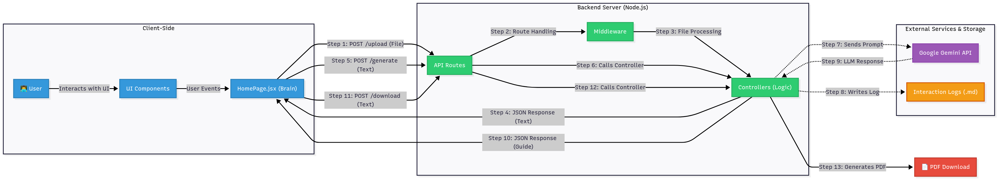

# 🚀 System Design Document: Syllanapse AI

**Author:** Rohit Guleria

**Project:** AI Agent Prototype (Syllanapse AI)

---

> ### **1. Vision & Core Concept: Solving a Universal Student Problem**

As a student myself, I know one of our most time-consuming manual tasks is processing dense lecture notes. And let's be honest, according to the unwritten Engineer's Law 😉, most of us are cramming the night before an exam. The traditional process of summarizing, creating a study plan, and testing your own knowledge is repetitive and often wildly inefficient.

My vision for Syllanapse AI was to build a personal, intelligent study assistant to automate this entire workflow. Let's face it: the sad reality of many college exams is that they often rely on rote learning, with repetitive questions from professor's notes and previous years' papers. While I believe colleges should focus more on creative learning, this is the system we're in. This AI agent is my answer—a tool designed to help students like me ace these exams. 🎯

The goal wasn't just to build a simple summarizer, but to create a **collaborative agent** 🧠 that could **reason** about the content, **plan** a study strategy, and **execute** by generating genuinely useful materials. I wanted to build a tool that I would use every single day—one that understands not just my notes, but also my specific study goals for that session. This prototype is a perfect base for that; I wrote scalable code and clean docs so that whenever it's required, expansion can be done right on top of it. 🏗️

---

> ### **2. Architecture & Philosophy: Building a Solid Foundation**

From the outset, I chose a classic **client-server architecture**. This was a deliberate choice to build a robust and scalable application, separating the user interface (the "looks") from the intensive backend logic (the "brains"). This separation is key for maintainability and for adding more complex features in the future, a lesson I've applied from my work on projects like Campus Hive. (And for any evaluators who've read this far—yes, you can find Campus Hive on my GitHub too! It's another fun project I'm passionate about scaling into a great personal product. 😉)

#### **Architecture Diagram 🗺️**

---

> ### **3. The User's Journey: A Step-by-Step Data Flow**

To really understand the system's design, it's best to walk through the complete data flow, from the user's first click to their final downloadable document.

1.  **📥 The Input & Form Data:** The journey kicks off on our clean React frontend. The user selects a local PDF or TXT file and clicks "Extract Text," sending a `FormData` object via a `POST` request to our Express backend's `/api/v1/ai/upload` endpoint.

2.  **🔍 In-Memory Processing & Text Extraction:** The backend catches the request. Here, our custom `multer` middleware intercepts the `FormData`, handling the file upload efficiently and securely **in memory** as a buffer, avoiding unnecessary disk writes. This buffer is then passed to the `pdf-parse` library, which does the heavy lifting of parsing the PDF structure and extracting the raw text content. This text is then packaged into a JSON `ApiResponse` and sent straight back to the frontend.

3.  **🤝 The Collaborative Interface:** Now, the frontend holds the extracted text in its state. This is where the user co-pilots the AI. They use the UI to choose a specific output mode from a dropdown (e.g., "Full Study Guide," "Quiz Mode") and can add their own custom instructions in a text area. These choices are also stored in the React component's state, ready for the next step.

4.  **🧠 Prompt Engineering (The "Thinking" Process):** With the game plan set, the user clicks "Generate." This triggers a second, main `POST` request to the `/api/v1/ai/generate-study-guide` endpoint. This time, the request body is a simple JSON object containing the `textContent`, `userPrompt`, and selected `mode`. Our backend controller then plays the role of a master chef 🧑‍🍳, combining its own system rules, the user's specific request, and the notes into one perfect recipe: the master prompt.

5.  **✍️ AI Execution & Asynchronous Logging:** This master prompt is sent asynchronously to the Google Gemini API. Once Gemini returns its response, our backend does two crucial things at once: it uses Node's `fs/promises` module to **append** the entire conversation to our `agent_interaction_logs.md` file (our agent's "black box recorder"), and it sends the final result back to the user's browser.

6.  **✨ Dynamic Rendering in the UI:** The React frontend receives the AI-generated content. The `react-markdown` library then takes this raw Markdown text and beautifully renders it into a clean, readable study guide on the screen, fulfilling the primary user goal with a polished and professional look.

7.  **📄 Server-Side PDF Generation & Cleanup:** To complete the workflow, the user can click "Download as PDF." This action triggers a final `POST` request, sending the raw AI-generated text back to a dedicated `/api/v1/ai/download-pdf` endpoint. The backend controller for this route executes a clever, robust process: it uses a library like `PDFKit` to write the text into a **temporary PDF file stored on the server's disk**. Once the file stream is finished and the document is saved, the server uses the `res.download()` method to send this file directly to the user's browser. As a final, crucial cleanup step, a callback function deletes the temporary file from the server's disk immediately after the download is complete, ensuring the server remains clean and efficient. This provides the user with a polished, portable document for their studies.

---

> ### **4. Deconstructing the Machine: Component Breakdown**

#### **Backend (The Engine Room) ⚙️**
* **The Foundation (`app.js`, `index.js`):** The server's core, setting up Express, CORS, and other essential middleware.
* **The Traffic Cop (`routes/`):** The router is the central hub for all API requests, directing traffic to the correct controller and applying middleware like `multer`.
* **The Brain (`controllers/`):** This is where all the heavy lifting happens—from text extraction to the art of prompt engineering and the crucial step of logging.
* **The Gatekeeper (`middlewares/`):** My `multer` middleware is configured here to be both efficient (using memory storage) and secure (enforcing file type/size limits).
* **The Toolkit (`utils/`):** I built a set of utility classes (`ApiResponse`, `ApiError`,`asyncHandle`) to ensure my code is professional, with standardized API responses ,robust error handling and avoid repetitive tasks.

#### **Frontend (The Cockpit) 🎨**
* **The Conductor (`pages/HomePage.jsx`):** This is the primary "smart" component. It manages all application state using React Hooks and handles all API calls. By "lifting state up," I created a single source of truth, ensuring the UI stays perfectly in sync.
* **The Building Blocks (`components/`):** The rest of the UI is composed of "dumb" presentational components that receive data and functions as props, making the UI modular and easy to reason about.
    * `Header.jsx`: A simple, static presentational component that acts as the visual head for the application, displaying the project's title and tagline.
    * `ControlPanel.jsx`: The main interactive hub where the user provides all inputs.
    * `StatusDisplay.jsx`: Provides crucial real-time feedback to the user—a key UX principle.
    * `ResultsDisplay.jsx`: Focuses solely on rendering the final AI output beautifully.
    * `Footer.jsx`: Just a simple presentational component for my name and copyright.

---

> ### **5. The Toolbox: Technology Choices & Justification**

Every tool in this project was chosen for a specific, practical reason. My philosophy was to use the right tool for the right job, balancing modern performance with stability and my own development strengths.

| Technology             | Area    | Why I Chose It                                                                                                                                                                                                                                                         |
| ---------------------- | ------- | ---------------------------------------------------------------------------------------------------------------------------------------------------------------------------------------------------------------------------------------------------------------------- |
| **Node.js & Express** | Backend | 🚀 This was my home turf. As a developer with strong MERN stack experience, using Node.js and Express allowed me to build with both speed and confidence. Node's non-blocking architecture is also a perfect match for an AI application that needs to patiently wait for an LLM response without freezing up. |
| **React & Vite** | Frontend| ⚡ For the frontend, Vite was a non-negotiable. Its lightning-fast development server is a massive upgrade over older tools. React's component-based model was essential for building a clean and maintainable UI, allowing me to construct the interface in modular, Lego-like pieces. |
| **Google Gemini API** | AI Core | 🤖 I evaluated several models, but Gemini's `1.5-flash` offered state-of-the-art reasoning with a free tier that was impossible to ignore for a prototype. It was a strategic choice to deliver maximum power without the overhead. (And yes, while OpenAI's models are fantastic, this one was free—a no-brainer! 😉) |
| **multer & pdf-parse** | Backend | 🔧 Rather than pulling in a heavy, all-in-one library, I chose these two lightweight, battle-tested tools. `multer` is the industry standard for handling file uploads in Express, and `pdf-parse` proved to be the most reliable tool for the specific job of extracting text from digital PDFs after some deep debugging. |
| **PDFKit** | Backend | 📄 When it came to the "Download as PDF" feature, I needed a powerful, purely server-side solution. `PDFKit` is a mature library that gave me direct, low-level control over creating the PDF stream on the backend, ensuring a seamless and reliable download experience for the user. |
| **Tailwind CSS** | Styling | 💅 In a rapid prototype environment, writing custom CSS from scratch is a huge time sink. Tailwind allowed me to design a modern, fully responsive, and visually stunning UI directly within my JSX, which let me focus on the logic and user experience instead of fighting with CSS files. |

---

> ### **6. Challenges & Learnings: A Developer's Diary**

Every project worth doing has its share of hurdles, and this one was no exception. These challenges weren't just bugs; they were invaluable learning experiences that I believe have made me a better engineer.

#### **The Great PDF Library Battle ⚔️**
The most significant technical challenge of this project was, without a doubt, getting a PDF parsing library to work correctly within my modern Node.js (ESM) setup. It started with a series of cryptic `ENOENT` errors from `pdf-parse` that I had never seen before. I spent a couple of hours stuck, using AI tools and digging through documentation. While the AI provided some initial direction, the final breakthrough came from combining that with a deep dive into the library's official docs.

My debugging journey was a deep dive:
1.  First, I suspected a module resolution conflict and tried experimental Node.js flags. No luck.
2.  Then, I switched to a different, more powerful library, `pdfjs-dist`. This led to a new set of errors, including a `DOMMatrix is not defined` error, which taught me a crucial lesson about browser-only code vs. server-side code.
3.  Finally, after multiple failed attempts, I arrived at the correct solution: going back to the simpler `pdf-parse` but loading it at **runtime** inside the controller using Node's built-in `createRequire`.

**What I Learned:** This was a powerful, hands-on lesson in Node's module architecture. It taught me the importance of understanding not just *what* a library does, but *how* it's built and loaded. I now have a much deeper understanding of how modern ES Modules interact with older CommonJS libraries. It also reinforced a key engineering mindset: when one path is blocked, you have to be ready to backtrack, re-evaluate, and try a completely different approach.

#### **Teaching the AI Good Manners (Prompt Engineering) 👨‍🏫**
Getting the AI to format its output consistently was a challenge in itself. My initial prompts were too general, and the AI would return messy, hard-to-read MCQ answers. The solution was to become extremely explicit and demanding in my instructions. I iterated on the prompt multiple times, adding strict rules like "each option must be on a new, separate line" and "the answer must be on its own line, formatted exactly as...".

**What I Learned:** This was a practical masterclass in prompt engineering. It's less about simply asking the AI for something and more about **commanding** it to produce a predictable, structured output that fits perfectly into your UI.

#### **Speaking the Right API Dialect 🗣️**
In the early stages, my calls to the Gemini API were failing with `401 Unauthorized` errors, even though my API key was correct. The issue, I discovered, was that my initial `axios` request was formatted in the style of an OpenAI API call (`Authorization: Bearer ...`).

**What I Learned:** This was a classic integration mistake that reinforced a key principle: always RTFM (Read The Friendly Manual). It was a valuable reminder that every API has its own unique "dialect," and using the official SDK (like `@google/generali-ai`) is almost always the most robust and error-free path forward.

---

> ### **7. The Road Ahead: Where I'd Take This Next**

This prototype is a solid foundation, but for me, it's just the starting point. I built this with scalability in mind, so adding new features would be the next logical step. Here's a quick roadmap of what I'm thinking.

* **🔐 First Things First: Logins & Personalization**
    The very first thing I was going to add was user authentication. Honestly, the only reason it's not in here now is because my mid-sem exams are in two days, and I had to make a tough call to focus on perfecting the core agent first. But adding logins is the key to making this a truly personal tool where users can save their study guides and see their history.

* **👀 Giving the Agent "Eyes" with OCR**
    Right now, the agent is a pro at reading digital text. The next big upgrade would be to give it "eyes" by integrating an OCR (Optical Character Recognition) tool, probably using something like Google Cloud Vision AI. That would be a game-changer, letting it read scanned book chapters or handwritten notes.

* **🧠 Giving the Agent a Real "Memory" using RAG**
    To make this feel less like a one-shot tool and more like a real study partner, it needs a memory. That's where I'd bring in a RAG (Retrieval-Augmented Generation) setup. By connecting the agent to a vector database like Pinecone, it could remember past conversations, making it way smarter and more context-aware for follow-up questions.

* **🛠️ Leveling Up with a Framework like LangChain**
    Once the agent has all these new tools in its belt (OCR, memory, etc.), managing the workflow starts to get complicated. That's when I'd reach for a framework like LangChain. It's built to help handle these complex, multi-step tasks, turning my current "tool-based" logic into a true multi-agent system. It's the right way to handle that level of complexity without reinventing the wheel.